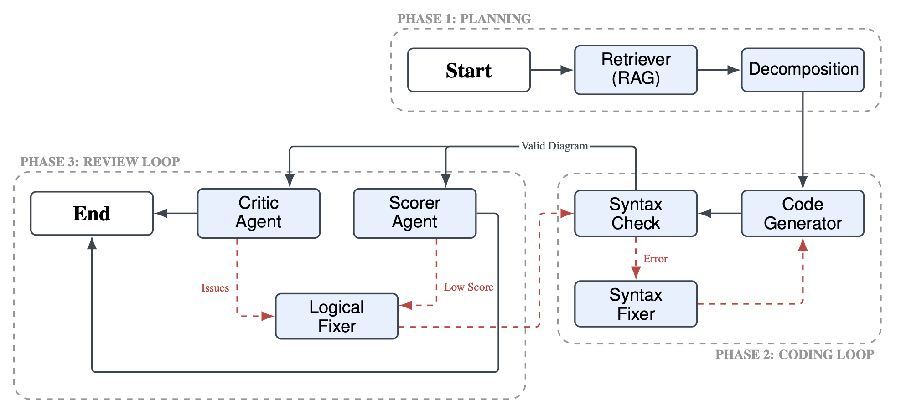

# A4Design: Generating and Correcting Design Diagrams with LLMs

This is the official repository of the **A4Design** project. The full paper can be accessed [here](report/A4_Design.pdf).

> **Abstract:** Generating formal software design artifacts from natural language requirements is a complex task that demands strict adherence to structural and logical constraints. While Large Language Models (LLMs) have shown promise in code synthesis, they frequently struggle to produce consistent and syntactically valid UML diagrams when operating in a single-shot manner. In this paper, we present **A4Design**, an automated framework that addresses these limitations through a cyclic multi-agent architecture. Unlike standard baselines, our approach decomposes the generation process into specialized phases of extraction, synthesis, and iterative refinement, leveraging feedback loops to self-correct syntax and logical inconsistencies. We evaluate the system using a robust semantic framework designed to measure domain fidelity beyond simple textual overlap. Our comparative analysis demonstrates that the multi-agent workflow enhances relationship mapping and syntactic validity, effectively eliminating common hallucinations found in direct generation approaches.

## Research Questions
- **RQ1:** How accurate are LLMs at generating formal design diagrams from natural language?
- **RQ2:** Can multi-agent pipelines improve diagram consistency compared to single-agent baselines?
- **RQ3:** How effective are LLMs at detecting and correcting structural errors in diagrams?

---

# System Architecture


The framework compares a **Single-Agent Baseline** against a novel **Multi-Agent Workflow**. The core implementation relies on **LangChain** for LLM abstraction and **LangGraph** for stateful agent orchestration.

### 1. Single-Agent Baseline
Acts as a control group to evaluate the intrinsic capabilities of the LLM.
* **Process:** Direct translation from requirements to PlantUML using Few-Shot RAG.
* **Limitations:** Lacks a feedback loop; hallucinations or syntax errors persist in the final output.

### 2. Multi-Agent Workflow
Modeled as a cyclic state machine, the workflow is decomposed into three specialized phases:

* **Phase 1: Planning (Retrieval & Decomposition)**
    * **Retriever:** Queries a FAISS vector database to find semantically similar few-shot examples (Top-k retrieval).
    * **Decomposition Agents:** Break down requirements into structured JSON components (Classes and Relationships) using a "Divide and Conquer" strategy.

* **Phase 2: Coding Loop (Generation & Syntax Refinement)**
    * **Generator:** Synthesizes the initial PlantUML code based on the decomposed plan.
    * **Syntax Fixer:** Iteratively corrects compilation errors reported by the PlantUML compiler until the code is renderable.

* **Phase 3: Review Loop (Semantic Refinement)**
    Syntactically valid diagrams undergo semantic review via one of two configurable strategies:
    * **Strategy A (Critic):** A qualitative agent generates a critique report. Convergence is determined by the **Normalized Levenshtein Similarity** between iterations ($\tau_{conv} = 0.96$).
    * **Strategy B (Scorer):** A quantitative agent evaluates the diagram on a 1-5 scale based on Moody's Quality Framework. Refinement continues until the score exceeds the optimal threshold ($\tau_{score} = 3.14$).

## Dataset & Evaluation
The system uses a structured dataset strictly stratified to prevent data leakage:
- **Few-shot Examples** (`data/processed/few_shot.json`): 3 exercises used for in-context learning (RAG).
- **Validation Set** (`data/processed/diagrams.json`): 14 exercises used for hyperparameter tuning and threshold optimization.
- **Test Set** (`data/processed/test_exercises.json`): 3 held-out complex scenarios (e.g., "Online Shopping") for final benchmarking.

## Metrics
The system evaluates generated diagrams against a human-created Gold Standard using **Structural Accuracy** (Precision, Recall, and F1 score for Classes, Attributes, and Relationships) computed in a Semantic Embedding Space.

## Project Structure
The repository is organized into core source code (`src`), dataset artifacts (`data`), and experimental results (`output`).

```bash
.
├── README.md
├── __init__.py
├── pyproject.toml
├── requirements.txt
├── assets/                             # Documentation images (architecture diagram)
├── report/
│   └── A4_Design.pdf                   # Full final paper
├── scripts/
│   └── main.py                         # Entry point for Single and Multi-agent modes
├── data/
│   ├── index.pkl                       # Vector store index for Retrieval
│   ├── processed/
│   │   ├── diagrams.json               # Validation set
│   │   ├── few_shot.json               # RAG examples
│   │   ├── labels.json                 # Ground truth labels
│   │   └── test_exercises.json         # Held-out test set
│   └── raw/
│       └── ground_truth.xlsx           # Original data source
├── src/
│   ├── config.py                       # Global configuration
│   ├── agents/
│   │   ├── multi_agent/                # Phase 1, 2, & 3 logic (Critic/Scorer)
│   │   └── single_agent/               # Baseline logic
│   ├── core/                           # Shared utilities (LLM, PlantUML, Prompts)
│   └── evaluation/                     # Metric calculation & Threshold optimization
└── output/
    ├── cache/                          # Optimization cache to avoid re-runs
    ├── evaluation/                     # JSON results of threshold tuning
    ├── plots/                          # Generated charts for the paper
    ├── single_agent/                   # Generated artifacts (Baseline)
    ├── multi_agent_critic/             # Generated artifacts (Strategy A)
    └── multi_agent_scorer/             # Generated artifacts (Strategy B)
```

---

# Setup & Installation

## Prerequisites
Before running the project, ensure you have the following components set up:

### 1. OpenRouter API Key
The project uses OpenRouter for accessing Large Language Models (LLMs). You need to obtain an API key from [OpenRouter](https://openrouter.ai/).

Create a `.env` file in the project root with the following content:
```
OPENROUTER_API_KEY=your_api_key_here
```

## Setup Instructions
1. **Clone the repository** and navigate to the project folder.
2. **Install dependencies**:
   ```bash
   pip install -r requirements.txt
   ```
   Alternatively, if using `pyproject.toml`:
   ```bash
   pip install -e .
   ```

## Usage

The project provides a unified entry point via `scripts/main.py`. Results are automatically saved to the `output/` directory, organized by run timestamp.

### 1. Run Single-Agent Baseline
Executes the standard one-shot generation without feedback loops.
```bash
python scripts/main.py --mode single
```
Output: `output/single_agent/`

### 2. Run Multi-Agent Workflow
You can choose between the two evaluation strategies described in the paper:

**Strategy A: Critic (Qualitative Feedback)** Uses the Critic agent to generate textual feedback and the Levenshtein metric for convergence.
```bash
python scripts/main.py --mode multi --evaluation critic
```
Output: `output/multi_agent_critic/`

**Strategy B: Scorer (Quantitative Feedback)** Uses the Scorer agent to evaluate diagrams on a 1-5 scale based on Moody's framework.
```bash
python scripts/main.py --mode multi --evaluation scorer
```
Output: `output/multi_agent_scorer/`

### 3. Threshold Optimization (Reproducibility)
To reproduce the experimental setup and recalculate the optimal thresholds (as seen in the paper's "Hyperparameter Optimization" section), you can run the optimization scripts:
```bash
# Optimize Convergence Threshold (tau_conv)
python src/evaluation/convergence_threshold_optimization.py

# Optimize Scoring Threshold (tau_score)
python src/evaluation/scoring_threshold_optimization.py
```
Results: `output/evaluation/`